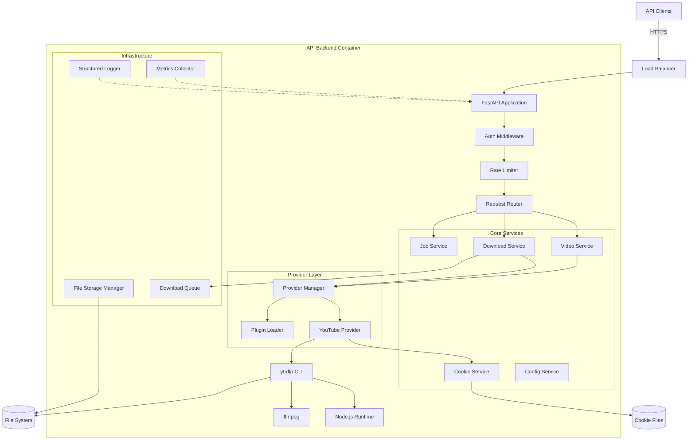
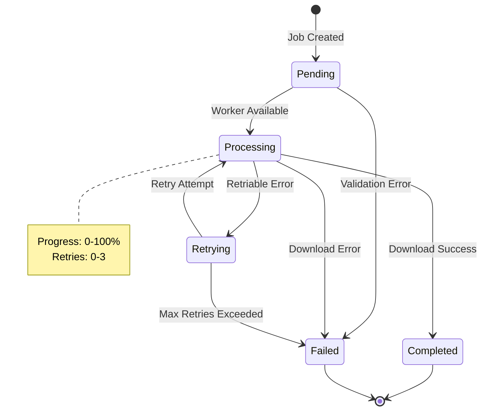
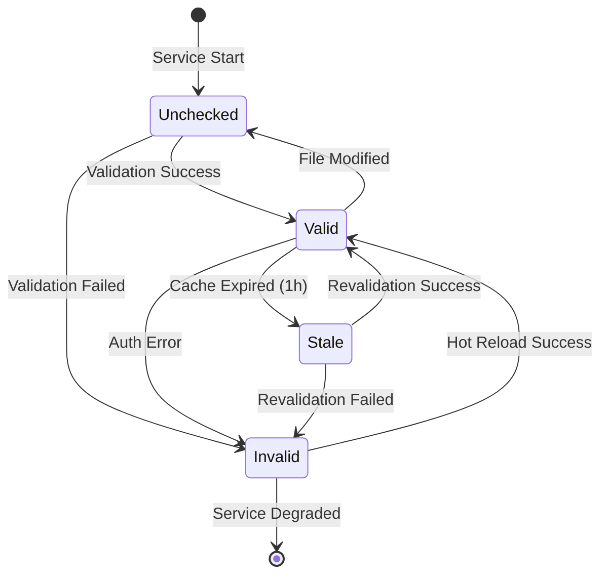
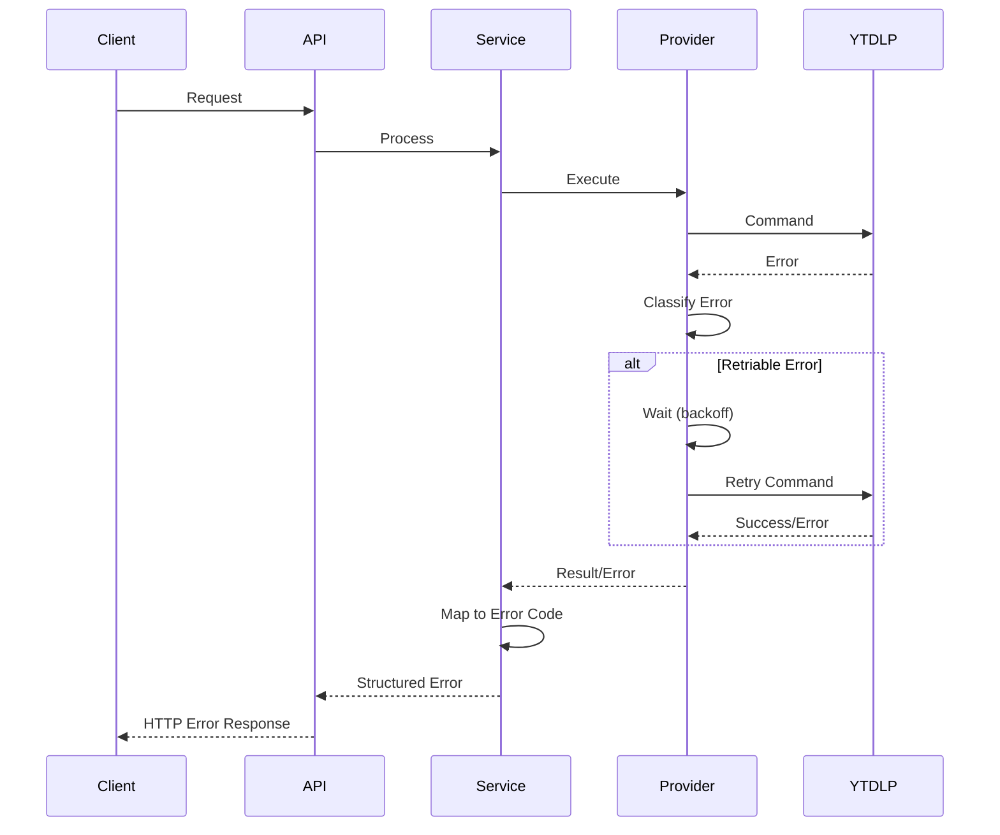
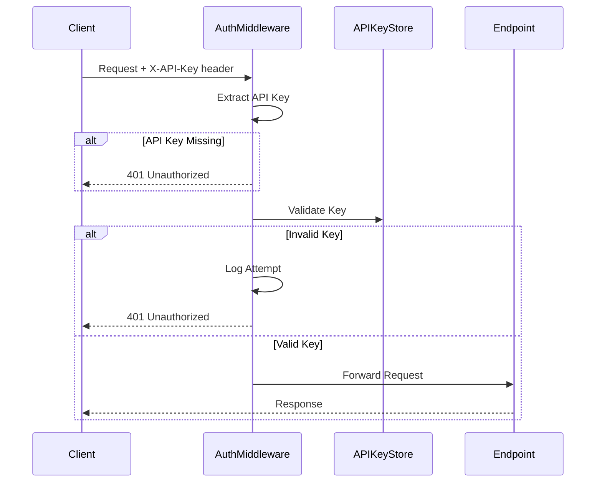
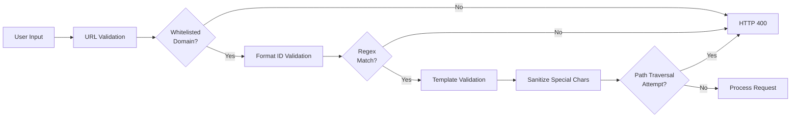
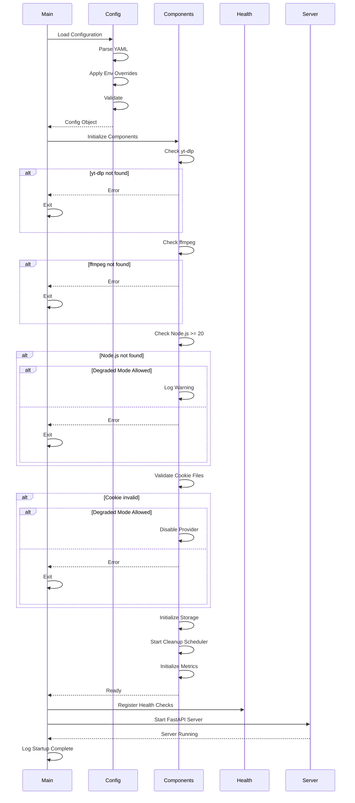

# Design Document

## Overview

This document describes the architecture and design of the yt-dlp REST API Backend, a containerized service that provides programmatic access to YouTube video downloads and metadata extraction. The system is built with Python using FastAPI framework, leveraging yt-dlp as the core download engine.

### Design Goals

- **Modularity**: Provider abstraction enables support for multiple video platforms
- **Scalability**: Async operations, rate limiting, and resource management support high-traffic scenarios
- **Reliability**: Comprehensive error handling, retry logic, and health monitoring ensure service stability
- **Security**: API key authentication, input validation, and container hardening protect against threats
- **Operability**: Structured logging, metrics export, and hot-reload capabilities simplify operations

### Technology Stack

- **Runtime**: Python 3.11+
- **Web Framework**: FastAPI (async support, OpenAPI generation, dependency injection)
- **Download Engine**: yt-dlp with Node.js runtime for JavaScript challenge resolution
- **Media Processing**: ffmpeg for audio conversion and format manipulation
- **Configuration**: YAML + environment variables
- **Containerization**: Docker with multi-stage builds
- **Metrics**: Prometheus client library
- **Logging**: structlog for JSON-formatted logs

## Architecture

### High-Level Architecture



### Component Responsibilities


**API Layer**
- FastAPI Application: HTTP server, request/response handling, OpenAPI documentation
- Auth Middleware: API key validation, request authentication
- Rate Limiter: Per-API-key rate limiting with burst support
- Request Router: Route requests to appropriate service handlers

**Core Services**
- Video Service: Metadata extraction, format listing, subtitle discovery
- Download Service: Video/audio download orchestration, format selection
- Job Service: Asynchronous job tracking, status reporting
- Cookie Service: Cookie lifecycle management, validation, hot-reload
- Config Service: Configuration loading, validation, environment variable override

**Provider Layer**
- Provider Manager: Provider selection, registration, lifecycle management
- YouTube Provider: YouTube-specific implementation of provider interface
- Plugin Loader: Dynamic loading and validation of external provider plugins

**Infrastructure**
- Structured Logger: JSON logging with request_id propagation
- Metrics Collector: Prometheus metrics collection and export
- File Storage Manager: Output directory management, cleanup, disk monitoring
- Download Queue: Concurrent download limiting, queue management

## Components and Interfaces

### Provider Interface

The provider abstraction enables support for multiple video platforms through a common interface.

```python
from abc import ABC, abstractmethod
from typing import Dict, List, Optional
from dataclasses import dataclass

@dataclass
class VideoInfo:
    video_id: str
    title: str
    duration: int  # seconds
    author: str
    upload_date: str  # ISO 8601
    view_count: int
    thumbnail_url: str
    description: str

@dataclass
class VideoFormat:
    format_id: str
    ext: str
    resolution: Optional[str]  # e.g., "1920x1080"
    audio_bitrate: Optional[int]  # kbps
    video_codec: Optional[str]
    audio_codec: Optional[str]
    filesize: Optional[int]  # bytes
    format_type: str  # "video+audio", "video-only", "audio-only"

@dataclass
class Subtitle:
    language: str
    format: str  # "vtt" or "srt"
    auto_generated: bool

@dataclass
class DownloadResult:
    file_path: str
    file_size: int
    duration: float  # seconds
    format_id: str

class VideoProvider(ABC):
    """Abstract base class for video platform providers"""

    @abstractmethod
    def validate_url(self, url: str) -> bool:
        """Validate if URL belongs to this provider"""
        pass

    @abstractmethod
    async def get_info(
        self,
        url: str,
        include_formats: bool = False,
        include_subtitles: bool = False
    ) -> Dict:
        """Extract video metadata"""
        pass

    @abstractmethod
    async def list_formats(self, url: str) -> List[VideoFormat]:
        """List all available formats"""
        pass

    @abstractmethod
    async def download(
        self,
        url: str,
        format_id: Optional[str] = None,
        output_template: Optional[str] = None,
        extract_audio: bool = False,
        audio_format: Optional[str] = None,
        include_subtitles: bool = False,
        subtitle_lang: Optional[str] = None
    ) -> DownloadResult:
        """Download video/audio"""
        pass

    @abstractmethod
    def get_cookie_path(self) -> Optional[str]:
        """Get provider-specific cookie file path"""
        pass
```

### API Endpoints

**Health and Monitoring**

```
GET /health
GET /readiness
GET /liveness
GET /metrics
```

**Video Operations**

```
GET /api/v1/info?url={url}&include_formats={bool}&include_subtitles={bool}
GET /api/v1/formats?url={url}
POST /api/v1/download
```

**Job Management**

```
GET /api/v1/jobs/{job_id}
```

**Administration**

```
POST /api/v1/admin/validate-cookie
POST /api/v1/admin/reload-cookie
```

**Documentation**

```
GET /docs
GET /openapi.json
```


### Request/Response Models

**Video Info Response**

```json
{
  "video_id": "dQw4w9WgXcQ",
  "title": "Example Video Title",
  "duration": 212,
  "author": "Channel Name",
  "upload_date": "2024-01-15T10:30:00Z",
  "view_count": 1000000,
  "thumbnail_url": "https://i.ytimg.com/vi/dQw4w9WgXcQ/maxresdefault.jpg",
  "description": "Video description...",
  "formats": [
    {
      "format_id": "137",
      "ext": "mp4",
      "resolution": "1920x1080",
      "video_codec": "avc1.640028",
      "audio_codec": null,
      "filesize": 52428800,
      "format_type": "video-only"
    }
  ],
  "subtitles": [
    {
      "language": "en",
      "format": "vtt",
      "auto_generated": false
    }
  ]
}
```

**Download Request**

```json
{
  "url": "https://www.youtube.com/watch?v=dQw4w9WgXcQ",
  "format_id": "137+140",
  "output_template": "%(title)s-%(id)s.%(ext)s",
  "extract_audio": false,
  "audio_format": null,
  "include_subtitles": true,
  "subtitle_lang": "en",
  "async": true
}
```

**Download Response**

```json
{
  "job_id": "550e8400-e29b-41d4-a716-446655440000",
  "status": "pending",
  "created_at": "2024-01-15T10:30:00Z"
}
```

**Job Status Response**

```json
{
  "job_id": "550e8400-e29b-41d4-a716-446655440000",
  "status": "completed",
  "progress": 100,
  "file_path": "/downloads/Example_Video-dQw4w9WgXcQ.mp4",
  "file_size": 52428800,
  "duration": 45.2,
  "created_at": "2024-01-15T10:30:00Z",
  "completed_at": "2024-01-15T10:30:45Z"
}
```

**Error Response**

```json
{
  "error_code": "VIDEO_UNAVAILABLE",
  "message": "The requested video is not available",
  "details": "Video is private or has been removed",
  "timestamp": "2024-01-15T10:30:00Z",
  "request_id": "req_abc123",
  "suggestion": "Verify the video URL is correct and publicly accessible"
}
```


## Data Models

### Configuration Schema

```yaml
server:
  host: "0.0.0.0"
  port: 8000
  workers: 4

timeouts:
  metadata: 10  # seconds
  download: 300
  audio_conversion: 60

storage:
  output_dir: "/app/downloads"
  cookie_dir: "/app/cookies"
  cleanup_age: 24  # hours
  cleanup_threshold: 80  # disk usage percentage
  max_file_size: 524288000  # 500MB in bytes

downloads:
  max_concurrent: 5
  queue_size: 100

rate_limiting:
  metadata_rpm: 100  # requests per minute
  download_rpm: 10
  burst_capacity: 20  # maximum tokens (burst size)

templates:
  default_output: "%(title)s-%(id)s.%(ext)s"

providers:
  youtube:
    enabled: true
    cookie_path: "${YOUTUBE_COOKIE_PATH}"
    retry_attempts: 3
    retry_backoff: [2, 4, 8]

logging:
  level: "INFO"
  format: "json"

security:
  api_keys:
    - "${API_KEY_1}"
    - "${API_KEY_2}"
  allow_degraded_start: false

monitoring:
  metrics_enabled: true
  metrics_port: 9090
```

### Job State Machine



**Job Status Enum**

```python
import enum
from dataclasses import dataclass

class JobStatus(enum.Enum):
    PENDING = "pending"
    PROCESSING = "processing"
    RETRYING = "retrying"
    COMPLETED = "completed"
    FAILED = "failed"

@dataclass
class Job:
    job_id: str
    status: JobStatus
    url: str
    params: dict
    progress: int = 0
    retry_count: int = 0
    max_retries: int = 3
    error_message: Optional[str] = None
    file_path: Optional[str] = None
    created_at: datetime
    completed_at: Optional[datetime] = None
```

### Cookie Validation State




## Error Handling

### Error Code Taxonomy

**Client Errors (4xx)**
- `INVALID_URL`: Malformed or unsupported URL format
- `FORMAT_NOT_FOUND`: Requested format ID does not exist
- `FILE_TOO_LARGE`: File size exceeds configured limit
- `RATE_LIMIT_EXCEEDED`: API key rate limit reached
- `AUTH_FAILED`: Invalid or missing API key

**Server Errors (5xx)**
- `VIDEO_UNAVAILABLE`: Video not accessible (private, deleted, geo-blocked)
- `DOWNLOAD_FAILED`: Download operation failed after retries
- `TRANSCODING_FAILED`: Audio conversion failed
- `STORAGE_FULL`: Insufficient disk space
- `MISSING_COOKIE`: Cookie file not found or invalid
- `COOKIE_EXPIRED`: Cookie authentication failed
- `COMPONENT_UNAVAILABLE`: Required component (yt-dlp, ffmpeg, Node.js) not available

### Retry Strategy

**Retriable Errors**
- Network timeouts
- HTTP 5xx from YouTube
- Temporary file system errors
- Rate limiting from YouTube (with backoff)

**Non-Retriable Errors**
- Invalid URL format
- Video is private/deleted
- Format not available
- Authentication failures (after cookie validation)
- Disk full
- File size limit exceeded

**Retry Configuration**
```python
RETRY_CONFIG = {
    "max_attempts": 3,
    "backoff_seconds": [2, 4, 8],
    "retriable_errors": [
        "network_timeout",
        "http_5xx",
        "youtube_rate_limit"
    ]
}
```

### Error Response Flow




## Testing Strategy

### Unit Testing

**Scope**
- Provider interface implementations
- Input validation logic
- Configuration parsing and validation
- Error classification and mapping
- Output template sanitization
- Cookie validation logic
- Rate limiter algorithms

**Approach**
- Mock yt-dlp command execution
- Use test fixtures for video metadata
- Parameterized tests for URL validation
- Property-based testing for template sanitization

**Tools**
- pytest for test framework
- pytest-asyncio for async tests
- pytest-mock for mocking
- hypothesis for property-based testing

### Integration Testing

**Scope**
- End-to-end API request flows
- Provider manager and provider interaction
- Job queue and worker coordination
- Cookie hot-reload functionality
- Metrics collection and export
- Health check component verification

**Approach**
- Use test mode with demo videos
- Mock external YouTube API calls
- Test with real yt-dlp but controlled inputs
- Verify file system operations in isolated directories

### Security Testing

**Scope**
- Path traversal prevention in output templates
- API key validation and authentication
- Sensitive data redaction in logs
- Input validation boundary conditions
- Rate limiting enforcement

**Approach**
- Automated tests for redaction effectiveness (Req 17A)
- Fuzzing for input validation
- Security scanning of Docker images
- Penetration testing of API endpoints

### Performance Testing

**Scope**
- Concurrent download handling
- Rate limiter accuracy under load
- Memory usage during large downloads
- API response times under various loads

**Approach**
- Load testing with locust or k6
- Benchmark metadata extraction performance
- Stress test download queue
- Monitor resource usage with cAdvisor


## Deployment Architecture

### Docker Container Design

**Multi-Stage Build**

```dockerfile
# Stage 1: Build dependencies
FROM python:3.11-slim as builder
WORKDIR /build
COPY requirements.txt .
RUN pip install --user --no-cache-dir -r requirements.txt

# Stage 2: Runtime
FROM python:3.11-slim
RUN apt-get update && apt-get install -y \
    ffmpeg \
    nodejs \
    npm \
    && rm -rf /var/lib/apt/lists/*

# Create non-root user
RUN useradd -m -u 1000 appuser

# Copy Python dependencies
COPY --from=builder /root/.local /home/appuser/.local

# Install yt-dlp
RUN pip install --no-cache-dir yt-dlp

# Setup application
WORKDIR /app
COPY --chown=appuser:appuser . .

# Create directories
RUN mkdir -p /app/downloads /app/cookies /app/logs && \
    chown -R appuser:appuser /app

USER appuser

# Health check
HEALTHCHECK --interval=30s --timeout=3s --start-period=5s --retries=3 \
    CMD curl -f http://localhost:8000/health || exit 1

EXPOSE 8000

CMD ["python", "-m", "uvicorn", "app.main:app", "--host", "0.0.0.0", "--port", "8000"]
```

### Docker Compose Configuration

```yaml
version: '3.8'

services:
  ytdlp-api:
    build: .
    image: ytdlp-api:latest
    container_name: ytdlp-api
    restart: unless-stopped

    ports:
      - "8000:8000"
      - "9090:9090"  # Metrics

    environment:
      - APP_SERVER_PORT=8000
      - APP_LOG_LEVEL=INFO
      - APP_API_KEY=${API_KEY}
      - YOUTUBE_COOKIE_PATH=/app/cookies/youtube.txt
      - APP_ALLOW_DEGRADED_START=false

    volumes:
      - ./downloads:/app/downloads
      - ./cookies:/app/cookies:ro
      - ./config.yaml:/app/config.yaml:ro
      - ./logs:/app/logs

    healthcheck:
      test: ["CMD", "curl", "-f", "http://localhost:8000/health"]
      interval: 30s
      timeout: 3s
      retries: 3
      start_period: 10s

    deploy:
      resources:
        limits:
          cpus: '2.0'
          memory: 2G
        reservations:
          cpus: '1.0'
          memory: 1G

    security_opt:
      - no-new-privileges:true

    read_only: true
    tmpfs:
      - /tmp
      - /app/logs
```


### Kubernetes Deployment (Optional)

```yaml
apiVersion: apps/v1
kind: Deployment
metadata:
  name: ytdlp-api
spec:
  replicas: 3
  selector:
    matchLabels:
      app: ytdlp-api
  template:
    metadata:
      labels:
        app: ytdlp-api
    spec:
      securityContext:
        runAsNonRoot: true
        runAsUser: 1000
        fsGroup: 1000

      containers:
      - name: ytdlp-api
        image: ytdlp-api:latest
        ports:
        - containerPort: 8000
          name: http
        - containerPort: 9090
          name: metrics

        env:
        - name: APP_API_KEY
          valueFrom:
            secretKeyRef:
              name: ytdlp-secrets
              key: api-key

        volumeMounts:
        - name: downloads
          mountPath: /app/downloads
        - name: cookies
          mountPath: /app/cookies
          readOnly: true
        - name: config
          mountPath: /app/config.yaml
          subPath: config.yaml
          readOnly: true

        resources:
          requests:
            memory: "1Gi"
            cpu: "1000m"
          limits:
            memory: "2Gi"
            cpu: "2000m"

        livenessProbe:
          httpGet:
            path: /liveness
            port: 8000
          initialDelaySeconds: 10
          periodSeconds: 30

        readinessProbe:
          httpGet:
            path: /readiness
            port: 8000
          initialDelaySeconds: 5
          periodSeconds: 10

      volumes:
      - name: downloads
        persistentVolumeClaim:
          claimName: ytdlp-downloads
      - name: cookies
        secret:
          secretName: ytdlp-cookies
      - name: config
        configMap:
          name: ytdlp-config
```


## Security Design

### Authentication Flow



### Input Validation Pipeline



### Sensitive Data Redaction

**Log Redaction Rules**
```python
REDACTION_PATTERNS = {
    "cookie": r"--cookies\s+[^\s]+",
    "api_key": r"X-API-Key:\s*[^\s]+",
    "auth_header": r"Authorization:\s*[^\s]+",
    "password": r"--password\s+[^\s]+"
}

def redact_command(command: str) -> str:
    """Redact sensitive information from command strings"""
    for pattern_name, pattern in REDACTION_PATTERNS.items():
        command = re.sub(pattern, f"--{pattern_name} [REDACTED]", command)
    return command
```

### Container Security Hardening

**Security Measures**
- Non-root user execution (UID 1000)
- Read-only root filesystem
- No new privileges flag
- Minimal base image (python:3.11-slim)
- No secrets in image layers
- Resource limits (CPU, memory)
- Network isolation (no unnecessary ports)
- Regular security scanning (Trivy, Snyk)

**File System Permissions**
```
/app                    - Read-only (owned by root)
/app/downloads          - Read-write (owned by appuser)
/app/cookies            - Read-only (owned by root, readable by appuser)
/app/logs               - Read-write (tmpfs, owned by appuser)
/tmp                    - Read-write (tmpfs, owned by appuser)
```


## Monitoring and Observability

### Metrics

**Prometheus Metrics**

```python
# Request metrics
http_requests_total = Counter(
    'http_requests_total',
    'Total HTTP requests',
    ['method', 'endpoint', 'status']
)

http_request_duration_seconds = Histogram(
    'http_request_duration_seconds',
    'HTTP request duration',
    ['method', 'endpoint'],
    buckets=[0.1, 0.5, 1.0, 2.0, 5.0, 10.0, 30.0]
)

# Download metrics
downloads_total = Counter(
    'downloads_total',
    'Total downloads',
    ['provider', 'status']
)

download_duration_seconds = Histogram(
    'download_duration_seconds',
    'Download duration',
    ['provider'],
    buckets=[10, 30, 60, 120, 300]
)

download_size_bytes = Histogram(
    'download_size_bytes',
    'Downloaded file size',
    ['provider'],
    buckets=[1e6, 10e6, 50e6, 100e6, 500e6, 1e9]
)

# Queue metrics
download_queue_size = Gauge(
    'download_queue_size',
    'Current download queue size'
)

concurrent_downloads = Gauge(
    'concurrent_downloads',
    'Active concurrent downloads'
)

# Storage metrics
storage_used_bytes = Gauge(
    'storage_used_bytes',
    'Storage space used'
)

storage_available_bytes = Gauge(
    'storage_available_bytes',
    'Storage space available'
)

# Rate limiting metrics
rate_limit_exceeded_total = Counter(
    'rate_limit_exceeded_total',
    'Rate limit exceeded events',
    ['api_key_hash', 'endpoint_category']
)

# Cookie metrics
cookie_validation_total = Counter(
    'cookie_validation_total',
    'Cookie validation attempts',
    ['provider', 'result']
)

cookie_age_seconds = Gauge(
    'cookie_age_seconds',
    'Cookie file age',
    ['provider']
)

# Error metrics by type
download_errors_total = Counter(
    'download_errors_total',
    'Download errors by type',
    ['provider', 'error_code']
)
```


### Structured Logging

**Log Schema**

```json
{
  "timestamp": "2024-01-15T10:30:00.123Z",
  "level": "INFO",
  "request_id": "req_abc123",
  "logger": "app.services.download",
  "message": "Download completed successfully",
  "context": {
    "video_id": "dQw4w9WgXcQ",
    "provider": "youtube",
    "format_id": "137+140",
    "file_size": 52428800,
    "duration": 45.2,
    "api_key_hash": "sha256:abc..."
  },
  "performance": {
    "operation": "download",
    "duration_ms": 45200
  }
}
```

**API Key Hashing Utility**

```python
import hashlib

def hash_api_key(api_key: str) -> str:
    """Hash API key for safe logging"""
    return f"sha256:{hashlib.sha256(api_key.encode()).hexdigest()[:16]}"

# Usage in logging
logger.info(
    "Request authenticated",
    api_key_hash=hash_api_key(api_key),
    endpoint=request.url.path
)
```

**Log Levels**

- **DEBUG**: yt-dlp commands (redacted), detailed operation steps
- **INFO**: Request received, operation completed, configuration loaded
- **WARNING**: Cookie age warning, retry attempts, degraded mode, approaching limits
- **ERROR**: Operation failures, validation errors, component unavailable
- **CRITICAL**: Service startup failure, unrecoverable errors

**Request ID Propagation**

```python
import contextvars
from uuid import uuid4

request_id_var = contextvars.ContextVar('request_id', default=None)

@app.middleware("http")
async def request_id_middleware(request: Request, call_next):
    request_id = request.headers.get('X-Request-ID', str(uuid4()))
    request_id_var.set(request_id)

    response = await call_next(request)
    response.headers['X-Request-ID'] = request_id
    return response

# In logging configuration
def add_request_id(logger, method_name, event_dict):
    event_dict['request_id'] = request_id_var.get()
    return event_dict
```

### Health Check Implementation

**Health Check Response**

```json
{
  "status": "healthy",
  "timestamp": "2024-01-15T10:30:00Z",
  "version": "1.0.0",
  "uptime_seconds": 86400,
  "components": {
    "ytdlp": {
      "status": "healthy",
      "version": "2024.01.15"
    },
    "ffmpeg": {
      "status": "healthy",
      "version": "6.0"
    },
    "nodejs": {
      "status": "healthy",
      "version": "20.10.0"
    },
    "cookie": {
      "status": "healthy",
      "age_hours": 2,
      "warning": null
    },
    "storage": {
      "status": "healthy",
      "available_gb": 50.5,
      "used_percent": 45
    },
    "youtube_connectivity": {
      "status": "healthy",
      "latency_ms": 120
    }
  }
}
```


## Performance Optimization

### Async Operations

**FastAPI Async Handlers**
```python
@router.get("/api/v1/info")
async def get_video_info(
    url: str,
    include_formats: bool = False,
    include_subtitles: bool = False,
    provider_manager: ProviderManager = Depends(get_provider_manager)
):
    provider = await provider_manager.get_provider_for_url(url)
    info = await provider.get_info(url, include_formats, include_subtitles)
    return info
```

**Concurrent Execution**
```python
import asyncio

async def get_info_with_formats_and_subtitles(url: str):
    # Execute format and subtitle extraction concurrently
    info_task = provider.get_info(url)
    formats_task = provider.list_formats(url)
    subtitles_task = provider.list_subtitles(url)

    info, formats, subtitles = await asyncio.gather(
        info_task, formats_task, subtitles_task
    )

    return {**info, "formats": formats, "subtitles": subtitles}
```

### Caching Strategy

**Cookie Validation Cache**
```python
from cachetools import TTLCache
import time

class CookieService:
    def __init__(self):
        self.validation_cache = TTLCache(maxsize=10, ttl=3600)  # 1 hour
        self.file_mtimes = {}

    async def is_cookie_valid(self, provider: str) -> bool:
        cookie_path = self.get_cookie_path(provider)
        current_mtime = os.path.getmtime(cookie_path)

        # Invalidate cache if file modified
        if self.file_mtimes.get(provider) != current_mtime:
            self.validation_cache.pop(provider, None)
            self.file_mtimes[provider] = current_mtime

        # Check cache
        if provider in self.validation_cache:
            return self.validation_cache[provider]

        # Validate and cache
        is_valid = await self._validate_cookie(provider)
        self.validation_cache[provider] = is_valid
        return is_valid
```

**Response Caching (Optional)**
```python
from fastapi_cache import FastAPICache
from fastapi_cache.backends.redis import RedisBackend
from fastapi_cache.decorator import cache

@router.get("/api/v1/info")
@cache(expire=300)  # Cache for 5 minutes
async def get_video_info(url: str):
    # Metadata rarely changes, safe to cache
    pass
```

### Resource Management

**Download Queue with Priority**
```python
import asyncio
from dataclasses import dataclass, field
from typing import Any
import heapq

@dataclass(order=True)
class QueuedDownload:
    priority: int
    job_id: str = field(compare=False)
    params: dict = field(compare=False)

class DownloadQueue:
    def __init__(self, max_concurrent: int = 5):
        self.max_concurrent = max_concurrent
        self.active_downloads = 0
        self.queue = []
        self.semaphore = asyncio.Semaphore(max_concurrent)

    async def enqueue(self, job_id: str, params: dict, priority: int = 10):
        # Lower priority number = higher priority
        # Metadata operations: priority 1
        # Download operations: priority 10
        item = QueuedDownload(priority, job_id, params)
        heapq.heappush(self.queue, item)

        if self.active_downloads < self.max_concurrent:
            await self._process_next()

    async def _process_next(self):
        if not self.queue:
            return

        async with self.semaphore:
            self.active_downloads += 1
            item = heapq.heappop(self.queue)

            try:
                await self._execute_download(item)
            finally:
                self.active_downloads -= 1
                await self._process_next()
```


### Rate Limiting Implementation

**Token Bucket Algorithm**
```python
import time
from collections import defaultdict
from dataclasses import dataclass

@dataclass
class TokenBucket:
    capacity: int
    refill_rate: float  # tokens per second
    tokens: float
    last_refill: float

class RateLimiter:
    def __init__(self):
        self.buckets = defaultdict(dict)

        # Configure limits per endpoint category
        self.limits = {
            "metadata": {"rpm": 100, "burst_capacity": 20},
            "download": {"rpm": 10, "burst_capacity": 20}
        }

    def _get_bucket(self, api_key: str, category: str) -> TokenBucket:
        if category not in self.buckets[api_key]:
            config = self.limits[category]
            self.buckets[api_key][category] = TokenBucket(
                capacity=config["burst_capacity"],
                refill_rate=config["rpm"] / 60.0,
                tokens=config["burst_capacity"],
                last_refill=time.time()
            )
        return self.buckets[api_key][category]

    def _refill_bucket(self, bucket: TokenBucket):
        now = time.time()
        elapsed = now - bucket.last_refill
        tokens_to_add = elapsed * bucket.refill_rate

        bucket.tokens = min(bucket.capacity, bucket.tokens + tokens_to_add)
        bucket.last_refill = now

    async def check_rate_limit(
        self,
        api_key: str,
        category: str
    ) -> tuple[bool, float]:
        """
        Returns (allowed, retry_after_seconds)
        """
        bucket = self._get_bucket(api_key, category)
        self._refill_bucket(bucket)

        if bucket.tokens >= 1.0:
            bucket.tokens -= 1.0
            return True, 0.0
        else:
            # Calculate retry after
            tokens_needed = 1.0 - bucket.tokens
            retry_after = tokens_needed / bucket.refill_rate
            return False, retry_after

# Middleware integration
@app.middleware("http")
async def rate_limit_middleware(request: Request, call_next):
    api_key = request.headers.get("X-API-Key")
    category = get_endpoint_category(request.url.path)

    allowed, retry_after = await rate_limiter.check_rate_limit(api_key, category)

    if not allowed:
        return JSONResponse(
            status_code=429,
            headers={"Retry-After": str(int(retry_after))},
            content={
                "error_code": "RATE_LIMIT_EXCEEDED",
                "message": f"Rate limit exceeded for {category} operations",
                "retry_after": retry_after
            }
        )

    return await call_next(request)
```


## File Management

### Storage Manager Design

```python
import os
import shutil
from pathlib import Path
from datetime import datetime, timedelta
import asyncio

class StorageManager:
    def __init__(self, config: dict):
        self.output_dir = Path(config["output_dir"])
        self.cleanup_age = timedelta(hours=config["cleanup_age"])
        self.cleanup_threshold = config["cleanup_threshold"]
        self.max_file_size = config["max_file_size"]
        self.active_jobs = {}  # {job_id: filename}

    async def get_disk_usage(self) -> dict:
        """Get disk usage statistics"""
        stat = shutil.disk_usage(self.output_dir)
        return {
            "total_bytes": stat.total,
            "used_bytes": stat.used,
            "available_bytes": stat.free,
            "used_percent": (stat.used / stat.total) * 100
        }

    async def should_cleanup(self) -> bool:
        """Check if cleanup should run"""
        usage = await self.get_disk_usage()
        return usage["used_percent"] >= self.cleanup_threshold

    async def cleanup_old_files(self, dry_run: bool = False) -> dict:
        """Remove files older than retention period"""
        now = datetime.now()
        cutoff = now - self.cleanup_age

        deleted_files = []
        reclaimed_bytes = 0

        for file_path in self.output_dir.rglob("*"):
            if not file_path.is_file():
                continue

            # Skip files referenced by active jobs
            if await self.is_file_active(file_path):
                continue

            # Check file age
            mtime = datetime.fromtimestamp(file_path.stat().st_mtime)
            if mtime < cutoff:
                file_size = file_path.stat().st_size

                if not dry_run:
                    file_path.unlink()

                deleted_files.append({
                    "path": str(file_path),
                    "size": file_size,
                    "age_hours": (now - mtime).total_seconds() / 3600
                })
                reclaimed_bytes += file_size

        return {
            "deleted_count": len(deleted_files),
            "reclaimed_bytes": reclaimed_bytes,
            "files": deleted_files
        }

    async def validate_file_size(self, estimated_size: int) -> bool:
        """Check if file size is within limits"""
        if estimated_size > self.max_file_size:
            return False

        # Check available space
        usage = await self.get_disk_usage()
        if estimated_size > usage["available_bytes"]:
            return False

        return True

    async def is_file_active(self, filepath: Path) -> bool:
        """Check if file is referenced by active job"""
        return filepath.name in self.active_jobs.values()

    def register_active_job(self, job_id: str, filename: str):
        """Mark file as in-use by active job"""
        self.active_jobs[job_id] = filename

    def unregister_active_job(self, job_id: str):
        """Remove file from active jobs"""
        self.active_jobs.pop(job_id, None)

# Periodic cleanup task
async def cleanup_scheduler(storage_manager: StorageManager):
    while True:
        try:
            if await storage_manager.should_cleanup():
                result = await storage_manager.cleanup_old_files()
                logger.info(
                    "Cleanup completed",
                    deleted_count=result["deleted_count"],
                    reclaimed_mb=result["reclaimed_bytes"] / 1024 / 1024
                )
        except Exception as e:
            logger.error("Cleanup failed", error=str(e))

        # Run every hour
        await asyncio.sleep(3600)
```


### Output Template Processing

```python
import re
from pathlib import Path

class TemplateProcessor:
    # Allowed template variables
    ALLOWED_VARS = {
        "title", "id", "ext", "upload_date",
        "uploader", "resolution", "format_id"
    }

    # Characters to sanitize
    INVALID_CHARS = r'[<>:"/\\|?*\x00-\x1f]'

    def __init__(self, default_template: str):
        self.default_template = default_template

    def sanitize_template(self, template: str) -> str:
        """Sanitize user-provided template"""
        # Check for path traversal
        if ".." in template or template.startswith("/"):
            raise ValueError("Path traversal detected in template")

        # Validate template variables
        vars_in_template = re.findall(r'%\((\w+)\)', template)
        invalid_vars = set(vars_in_template) - self.ALLOWED_VARS
        if invalid_vars:
            raise ValueError(f"Invalid template variables: {invalid_vars}")

        return template

    def apply_template(self, template: str, metadata: dict) -> str:
        """Apply template with metadata"""
        # Sanitize metadata values
        safe_metadata = {}
        for key, value in metadata.items():
            if key in self.ALLOWED_VARS:
                # Remove invalid filesystem characters
                safe_value = re.sub(self.INVALID_CHARS, "_", str(value))
                # Limit length
                safe_value = safe_value[:200]
                safe_metadata[key] = safe_value

        # Apply template
        try:
            filename = template % safe_metadata
        except KeyError as e:
            raise ValueError(f"Missing metadata for template variable: {e}")

        return filename

    def handle_collision(self, filepath: Path) -> Path:
        """Handle filename collisions by appending number"""
        if not filepath.exists():
            return filepath

        stem = filepath.stem
        suffix = filepath.suffix
        parent = filepath.parent
        counter = 1

        while True:
            new_path = parent / f"{stem}_{counter}{suffix}"
            if not new_path.exists():
                return new_path
            counter += 1

            # Safety limit
            if counter > 1000:
                raise ValueError("Too many filename collisions")
```


## Provider Implementation Details

### YouTube Provider

```python
import asyncio
import subprocess
import json
from typing import Optional, List, Dict

class YouTubeProvider(VideoProvider):
    # URL patterns
    URL_PATTERNS = [
        r'(?:https?://)?(?:www\.)?youtube\.com/watch\?v=[\w-]+',
        r'(?:https?://)?(?:www\.)?youtube\.com/shorts/[\w-]+',
        r'(?:https?://)?(?:www\.)?youtube\.com/embed/[\w-]+',
        r'(?:https?://)?youtu\.be/[\w-]+',
        r'(?:https?://)?m\.youtube\.com/watch\?v=[\w-]+'
    ]

    def __init__(self, config: dict, cookie_service: CookieService):
        self.config = config
        self.cookie_service = cookie_service
        self.retry_attempts = config.get("retry_attempts", 3)
        self.retry_backoff = config.get("retry_backoff", [2, 4, 8])

    def validate_url(self, url: str) -> bool:
        """Validate YouTube URL format"""
        import re
        return any(re.match(pattern, url) for pattern in self.URL_PATTERNS)

    async def get_info(
        self,
        url: str,
        include_formats: bool = False,
        include_subtitles: bool = False
    ) -> Dict:
        """Extract video metadata using yt-dlp"""
        # Validate cookie before operation
        await self.cookie_service.validate_cookie("youtube")

        cmd = [
            "yt-dlp",
            "--dump-json",
            "--no-download",
            "--cookies", self.get_cookie_path(),
            "--extractor-args", "youtube:player_client=web"
        ]

        if not include_formats:
            cmd.append("--skip-download")

        cmd.append(url)

        # Execute with retry
        result = await self._execute_with_retry(cmd)

        # Parse JSON output
        info = json.loads(result.stdout)

        # Transform to our format
        video_info = {
            "video_id": info["id"],
            "title": info["title"],
            "duration": info["duration"],
            "author": info["uploader"],
            "upload_date": info["upload_date"],
            "view_count": info["view_count"],
            "thumbnail_url": info["thumbnail"],
            "description": info["description"]
        }

        if include_formats:
            video_info["formats"] = self._parse_formats(info["formats"])

        if include_subtitles:
            video_info["subtitles"] = self._parse_subtitles(info.get("subtitles", {}))

        return video_info

    async def download(
        self,
        url: str,
        format_id: Optional[str] = None,
        output_template: Optional[str] = None,
        extract_audio: bool = False,
        audio_format: Optional[str] = None,
        include_subtitles: bool = False,
        subtitle_lang: Optional[str] = None
    ) -> DownloadResult:
        """Download video/audio"""
        await self.cookie_service.validate_cookie("youtube")

        cmd = [
            "yt-dlp",
            "--cookies", self.get_cookie_path(),
            "--extractor-args", "youtube:player_client=web",
            "--js-runtimes", "node"
        ]

        if format_id:
            cmd.extend(["-f", format_id])

        if extract_audio:
            cmd.extend(["-x", "--audio-format", audio_format or "mp3"])
            if audio_format in ["mp3", "m4a"]:
                cmd.extend(["--audio-quality", "0"])  # Best quality

        if output_template:
            cmd.extend(["-o", output_template])

        if include_subtitles:
            cmd.append("--write-subs")
            if subtitle_lang:
                cmd.extend(["--sub-langs", subtitle_lang])

        cmd.append(url)

        # Log command (redacted)
        logger.debug("Executing yt-dlp", command=self._redact_command(cmd))

        # Execute with retry
        start_time = time.time()
        result = await self._execute_with_retry(cmd)
        duration = time.time() - start_time

        # Log execution results (Req 17A)
        logger.debug(
            "yt-dlp execution completed",
            command=self._redact_command(cmd),
            exit_code=result.returncode,
            stdout_lines=len(result.stdout.decode().split('\n')),
            stderr_preview=result.stderr.decode()[:500] if result.stderr else None
        )

        # Parse output to get file path
        file_path = self._extract_file_path(result.stdout)
        file_size = Path(file_path).stat().st_size

        return DownloadResult(
            file_path=file_path,
            file_size=file_size,
            duration=duration,
            format_id=format_id or "best"
        )

    async def _execute_with_retry(
        self,
        cmd: List[str]
    ) -> subprocess.CompletedProcess:
        """Execute command with retry logic"""
        last_error = None

        for attempt in range(self.retry_attempts):
            try:
                result = await asyncio.create_subprocess_exec(
                    *cmd,
                    stdout=asyncio.subprocess.PIPE,
                    stderr=asyncio.subprocess.PIPE
                )

                stdout, stderr = await result.communicate()

                if result.returncode == 0:
                    return subprocess.CompletedProcess(
                        cmd, result.returncode, stdout, stderr
                    )

                # Check if error is retriable
                error_msg = stderr.decode()
                if not self._is_retriable_error(error_msg):
                    raise DownloadError(error_msg)

                last_error = error_msg

                # Wait before retry
                if attempt < self.retry_attempts - 1:
                    wait_time = self.retry_backoff[attempt]
                    logger.warning(
                        "Retrying after error",
                        attempt=attempt + 1,
                        wait_seconds=wait_time,
                        error=error_msg
                    )
                    await asyncio.sleep(wait_time)

            except Exception as e:
                last_error = str(e)
                if attempt == self.retry_attempts - 1:
                    raise

        raise DownloadError(f"Failed after {self.retry_attempts} attempts: {last_error}")

    def _is_retriable_error(self, error_msg: str) -> bool:
        """Determine if error should trigger retry"""
        retriable_patterns = [
            "HTTP Error 5",
            "Connection reset",
            "Timeout",
            "Too Many Requests"
        ]
        return any(pattern in error_msg for pattern in retriable_patterns)

    def get_cookie_path(self) -> str:
        """Get YouTube cookie file path"""
        return self.config.get("cookie_path", "/app/cookies/youtube.txt")

    def _redact_command(self, cmd: List[str]) -> List[str]:
        """Redact sensitive information from command"""
        redacted = []
        skip_next = False

        for i, arg in enumerate(cmd):
            if skip_next:
                redacted.append("[REDACTED]")
                skip_next = False
            elif arg in ["--cookies", "--password"]:
                redacted.append(arg)
                skip_next = True
            else:
                redacted.append(arg)

        return redacted
```


## Configuration Management

### Configuration Loading Strategy

```python
import yaml
import os
from typing import Any, Dict
from pathlib import Path

class ConfigService:
    def __init__(self, config_path: str = "config.yaml"):
        self.config_path = Path(config_path)
        self.config = {}
        self.env_prefix = "APP_"

    def load(self) -> Dict[str, Any]:
        """Load configuration from YAML and environment variables"""
        # Load YAML
        if self.config_path.exists():
            with open(self.config_path) as f:
                self.config = yaml.safe_load(f) or {}
        else:
            logger.warning("Config file not found, using defaults")
            self.config = self._get_defaults()

        # Override with environment variables
        self._apply_env_overrides()

        # Validate configuration
        self._validate()

        return self.config

    def _get_defaults(self) -> Dict[str, Any]:
        """Get default configuration values"""
        return {
            "server": {
                "host": "0.0.0.0",
                "port": 8000,
                "workers": 4
            },
            "timeouts": {
                "metadata": 10,
                "download": 300,
                "audio_conversion": 60
            },
            "storage": {
                "output_dir": "/app/downloads",
                "cookie_dir": "/app/cookies",
                "cleanup_age": 24,
                "cleanup_threshold": 80,
                "max_file_size": 524288000
            },
            "downloads": {
                "max_concurrent": 5,
                "queue_size": 100
            },
            "rate_limiting": {
                "metadata_rpm": 100,
                "download_rpm": 10,
                "burst_size": 20,
                "burst_window": 10
            },
            "templates": {
                "default_output": "%(title)s-%(id)s.%(ext)s"
            },
            "providers": {
                "youtube": {
                    "enabled": True,
                    "cookie_path": "/app/cookies/youtube.txt",
                    "retry_attempts": 3,
                    "retry_backoff": [2, 4, 8]
                }
            },
            "logging": {
                "level": "INFO",
                "format": "json"
            },
            "security": {
                "api_keys": [],
                "allow_degraded_start": False
            },
            "monitoring": {
                "metrics_enabled": True,
                "metrics_port": 9090
            }
        }

    def _apply_env_overrides(self):
        """Override config with environment variables"""
        # Mapping of env vars to config paths
        env_mappings = {
            "APP_SERVER_PORT": ("server", "port", int),
            "APP_SERVER_HOST": ("server", "host", str),
            "APP_LOG_LEVEL": ("logging", "level", str),
            "APP_OUTPUT_DIR": ("storage", "output_dir", str),
            "APP_COOKIE_DIR": ("storage", "cookie_dir", str),
            "APP_MAX_FILE_SIZE": ("storage", "max_file_size", int),
            "APP_MAX_CONCURRENT": ("downloads", "max_concurrent", int),
            "APP_METADATA_RPM": ("rate_limiting", "metadata_rpm", int),
            "APP_DOWNLOAD_RPM": ("rate_limiting", "download_rpm", int),
            "APP_ALLOW_DEGRADED_START": ("security", "allow_degraded_start", bool),
            "YOUTUBE_COOKIE_PATH": ("providers", "youtube", "cookie_path", str),
        }

        for env_var, (*path, type_func) in env_mappings.items():
            value = os.getenv(env_var)
            if value is not None:
                # Convert type
                if type_func == bool:
                    value = value.lower() in ("true", "1", "yes")
                else:
                    value = type_func(value)

                # Set in config
                self._set_nested(self.config, path, value)

        # Handle API keys (can be multiple)
        api_keys = []
        for i in range(1, 11):  # Support up to 10 API keys
            key = os.getenv(f"API_KEY_{i}")
            if key:
                api_keys.append(key)

        if api_keys:
            self.config["security"]["api_keys"] = api_keys

    def _set_nested(self, d: dict, path: tuple, value: Any):
        """Set nested dictionary value"""
        for key in path[:-1]:
            d = d.setdefault(key, {})
        d[path[-1]] = value

    def _validate(self):
        """Validate configuration"""
        # Check required fields
        if not self.config["security"]["api_keys"]:
            raise ValueError("At least one API key must be configured")

        # Validate ranges
        if self.config["downloads"]["max_concurrent"] < 1:
            raise ValueError("max_concurrent must be at least 1")

        if not 0 < self.config["storage"]["cleanup_threshold"] <= 100:
            raise ValueError("cleanup_threshold must be between 0 and 100")

        # Validate paths exist or can be created
        output_dir = Path(self.config["storage"]["output_dir"])
        if not output_dir.exists():
            output_dir.mkdir(parents=True, exist_ok=True)

        # Validate provider cookie paths
        for provider_name, provider_config in self.config["providers"].items():
            if not provider_config.get("enabled", True):
                continue

            cookie_path = Path(provider_config.get("cookie_path", ""))
            if not cookie_path.exists():
                if not self.config["security"]["allow_degraded_start"]:
                    raise ValueError(
                        f"Cookie file not found for {provider_name}: {cookie_path}"
                    )
                else:
                    logger.warning(f"Cookie missing for {provider_name}, provider disabled")
                    provider_config["enabled"] = False

        logger.info("Configuration validated successfully")
```


## Startup and Initialization

### Application Lifecycle



### Startup Checks

```python
import subprocess
import sys
from pathlib import Path

class StartupValidator:
    def __init__(self, config: dict):
        self.config = config
        self.allow_degraded = config["security"]["allow_degraded_start"]
        self.errors = []
        self.warnings = []

    async def validate_all(self) -> bool:
        """Run all startup validations"""
        checks = [
            self._check_ytdlp(),
            self._check_ffmpeg(),
            self._check_nodejs(),
            self._check_cookies(),
            self._check_storage(),
            self._check_permissions()
        ]

        results = await asyncio.gather(*checks, return_exceptions=True)

        # Log results
        for result in results:
            if isinstance(result, Exception):
                self.errors.append(str(result))

        if self.errors:
            if self.allow_degraded:
                logger.warning(
                    "Starting in degraded mode",
                    errors=self.errors
                )
                return True
            else:
                logger.error(
                    "Startup validation failed",
                    errors=self.errors
                )
                return False

        if self.warnings:
            logger.warning("Startup warnings", warnings=self.warnings)

        logger.info("All startup checks passed")
        return True

    async def _check_ytdlp(self):
        """Verify yt-dlp is installed"""
        try:
            result = subprocess.run(
                ["yt-dlp", "--version"],
                capture_output=True,
                text=True,
                timeout=5
            )
            version = result.stdout.strip()
            logger.info(f"yt-dlp version: {version}")
        except Exception as e:
            raise RuntimeError(f"yt-dlp not available: {e}")

    async def _check_ffmpeg(self):
        """Verify ffmpeg is installed"""
        try:
            result = subprocess.run(
                ["ffmpeg", "-version"],
                capture_output=True,
                text=True,
                timeout=5
            )
            version = result.stdout.split('\n')[0]
            logger.info(f"ffmpeg version: {version}")
        except Exception as e:
            raise RuntimeError(f"ffmpeg not available: {e}")

    async def _check_nodejs(self):
        """Verify Node.js >= 20 is installed"""
        try:
            result = subprocess.run(
                ["node", "--version"],
                capture_output=True,
                text=True,
                timeout=5
            )
            version = result.stdout.strip()
            major_version = int(version.lstrip('v').split('.')[0])

            if major_version < 20:
                raise RuntimeError(f"Node.js >= 20 required, found {version}")

            logger.info(f"Node.js version: {version}")
        except Exception as e:
            raise RuntimeError(f"Node.js not available: {e}")

    async def _check_cookies(self):
        """Verify cookie files exist and are valid"""
        for provider_name, provider_config in self.config["providers"].items():
            if not provider_config.get("enabled", True):
                continue

            cookie_path = Path(provider_config.get("cookie_path", ""))

            if not cookie_path.exists():
                raise RuntimeError(
                    f"Cookie file not found for {provider_name}: {cookie_path}"
                )

            # Check file age
            mtime = cookie_path.stat().st_mtime
            age_days = (time.time() - mtime) / 86400

            if age_days > 7:
                self.warnings.append(
                    f"Cookie file for {provider_name} is {age_days:.1f} days old"
                )

            # Test actual authentication with YouTube
            try:
                result = subprocess.run(
                    [
                        "yt-dlp",
                        "--cookies", str(cookie_path),
                        "--simulate",
                        "--playlist-items", "1",
                        "https://www.youtube.com/watch?v=jNQXAC9IVRw"
                    ],
                    capture_output=True,
                    timeout=10
                )

                if result.returncode != 0:
                    self.warnings.append(
                        f"Cookie validation test failed for {provider_name}"
                    )
            except Exception as e:
                self.warnings.append(f"Could not test cookie for {provider_name}: {e}")

            logger.info(
                f"Cookie file validated for {provider_name}",
                age_days=age_days
            )

    async def _check_storage(self):
        """Verify storage directories exist and have space"""
        output_dir = Path(self.config["storage"]["output_dir"])

        if not output_dir.exists():
            output_dir.mkdir(parents=True, exist_ok=True)
            logger.info(f"Created output directory: {output_dir}")

        # Check disk space
        stat = shutil.disk_usage(output_dir)
        available_gb = stat.free / (1024 ** 3)

        if available_gb < 1:
            raise RuntimeError(
                f"Insufficient disk space: {available_gb:.2f} GB available"
            )

        logger.info(f"Storage available: {available_gb:.2f} GB")

    async def _check_permissions(self):
        """Verify file permissions"""
        output_dir = Path(self.config["storage"]["output_dir"])

        # Test write permission
        test_file = output_dir / ".write_test"
        try:
            test_file.touch()
            test_file.unlink()
        except Exception as e:
            raise RuntimeError(
                f"No write permission in output directory: {e}"
            )

        # Test cookie read permission
        for provider_name, provider_config in self.config["providers"].items():
            if not provider_config.get("enabled", True):
                continue

            cookie_path = Path(provider_config.get("cookie_path", ""))
            if cookie_path.exists():
                try:
                    cookie_path.read_text()
                except Exception as e:
                    raise RuntimeError(
                        f"No read permission for cookie file: {e}"
                    )
```


## Design Decisions and Rationales

### Why FastAPI?

**Chosen**: FastAPI
**Alternatives Considered**: Flask, Django REST Framework, Starlette

**Rationale**:
- Native async/await support for concurrent operations
- Automatic OpenAPI documentation generation (Req 39)
- Built-in request validation with Pydantic
- High performance (comparable to Node.js and Go)
- Dependency injection system simplifies testing
- Active community and excellent documentation

### Why yt-dlp over youtube-dl?

**Chosen**: yt-dlp
**Alternatives Considered**: youtube-dl, pytube

**Rationale**:
- More actively maintained than youtube-dl
- Better handling of YouTube's anti-bot measures
- Built-in support for JavaScript challenge resolution
- More format options and better quality selection
- Regular updates to keep pace with YouTube changes
- Compatible with youtube-dl command-line interface

### Why Token Bucket for Rate Limiting?

**Chosen**: Token Bucket Algorithm
**Alternatives Considered**: Fixed Window, Sliding Window, Leaky Bucket

**Rationale**:
- Supports burst traffic (Req 27) while maintaining average rate
- Simple to implement and reason about
- Low memory overhead (one bucket per API key per category)
- Provides smooth rate limiting without hard cutoffs
- Industry standard (used by AWS, Google Cloud)

### Why Separate Liveness and Readiness Probes?

**Chosen**: Separate /liveness and /readiness endpoints
**Alternatives Considered**: Single /health endpoint

**Rationale**:
- Kubernetes best practice (Req 37)
- Liveness: "Is the process alive?" (restart if false)
- Readiness: "Can it handle traffic?" (remove from load balancer if false)
- Allows graceful handling of temporary issues (cookie expiry, disk full)
- Prevents cascading failures during degraded operation

### Why Priority Queue for Downloads?

**Chosen**: Priority queue with metadata operations prioritized
**Alternatives Considered**: FIFO queue, separate queues

**Rationale**:
- Metadata operations are fast and should not wait behind slow downloads
- Better user experience (info requests return quickly)
- Prevents head-of-line blocking
- Simple to implement with heapq
- Aligns with Req 26 (prioritize metadata over downloads)

### Why JSON Logging?

**Chosen**: Structured JSON logs with structlog
**Alternatives Considered**: Plain text logs, Python logging

**Rationale**:
- Machine-parseable for log aggregation systems (ELK, Splunk)
- Easy to filter and search by fields
- Consistent format across all log entries
- Supports nested context (request_id propagation)
- Better for containerized environments

### Why Not Use a Database?

**Chosen**: In-memory job tracking with TTL
**Alternatives Considered**: Redis, PostgreSQL, SQLite

**Rationale**:
- Simplifies deployment (no external dependencies)
- Job history only needed for 24 hours (Req 15)
- Reduces operational complexity
- Sufficient for single-instance deployment
- Can add database later if multi-instance needed

### Why Multi-Stage Docker Build?

**Chosen**: Multi-stage Dockerfile
**Alternatives Considered**: Single-stage build

**Rationale**:
- Smaller final image size (no build tools in runtime)
- Faster deployment (less data to transfer)
- Better security (fewer packages = smaller attack surface)
- Separates build-time and runtime dependencies
- Industry best practice for production containers


## Future Enhancements

### Phase 2: Multi-Platform Support

**Scope**: Extend beyond YouTube to support additional video platforms

**Implementation**:
- Add providers for: Vimeo, Dailymotion, Twitch
- Implement provider auto-detection based on URL
- Support platform-specific features (Twitch VODs, Vimeo privacy)
- Per-provider rate limiting and quotas

**Requirements Addressed**: Req 34, 36

### Phase 3: Playlist Support

**Scope**: Download entire playlists or channels

**Implementation**:
- New endpoint: POST /api/v1/playlist/download
- Batch job creation for playlist items
- Progress tracking for multi-video operations
- Configurable concurrency for playlist downloads
- Playlist metadata extraction

**Requirements Addressed**: Req 35 (YouTube playlist URLs)

### Phase 4: Webhook Notifications

**Scope**: Notify external systems when downloads complete

**Implementation**:
- Webhook configuration per API key
- Retry logic for webhook delivery
- Signature verification for webhook payloads
- Event types: download.completed, download.failed, job.queued

**New Requirements**: Async notification, webhook security

### Phase 5: Advanced Scheduling

**Scope**: Schedule downloads for specific times

**Implementation**:
- Cron-like scheduling syntax
- Recurring download support
- Time-based rate limiting (off-peak downloads)
- Integration with calendar systems

**New Requirements**: Scheduler service, persistent job storage

### Phase 6: Transcoding Pipeline

**Scope**: Custom video transcoding and processing

**Implementation**:
- Post-download transcoding to custom formats
- Video editing operations (trim, crop, watermark)
- Thumbnail extraction and generation
- Integration with ffmpeg filters

**New Requirements**: Transcoding queue, GPU support

### Phase 7: Multi-Instance Deployment

**Scope**: Horizontal scaling with multiple instances

**Implementation**:
- Shared job queue (Redis)
- Distributed rate limiting
- Shared file storage (S3, NFS)
- Leader election for cleanup tasks
- Load balancer integration

**New Requirements**: Distributed coordination, shared state

### Phase 8: Advanced Analytics

**Scope**: Detailed usage analytics and reporting

**Implementation**:
- Download history database
- Usage dashboards (Grafana)
- Cost tracking per API key
- Bandwidth usage reports
- Popular video tracking

**New Requirements**: Time-series database, analytics API


## Appendix

### Project Structure

```
ytdlp-api/
├── app/
│   ├── __init__.py
│   ├── main.py                 # FastAPI application entry point
│   ├── config.py               # Configuration service
│   ├── dependencies.py         # FastAPI dependencies
│   │
│   ├── api/
│   │   ├── __init__.py
│   │   ├── v1/
│   │   │   ├── __init__.py
│   │   │   ├── endpoints/
│   │   │   │   ├── __init__.py
│   │   │   │   ├── info.py
│   │   │   │   ├── download.py
│   │   │   │   ├── jobs.py
│   │   │   │   └── admin.py
│   │   │   └── router.py
│   │   └── health.py
│   │
│   ├── core/
│   │   ├── __init__.py
│   │   ├── auth.py             # API key authentication
│   │   ├── rate_limiter.py     # Rate limiting logic
│   │   ├── errors.py           # Error definitions
│   │   └── logging.py          # Structured logging setup
│   │
│   ├── services/
│   │   ├── __init__.py
│   │   ├── video.py            # Video service
│   │   ├── download.py         # Download service
│   │   ├── job.py              # Job tracking service
│   │   ├── cookie.py           # Cookie management
│   │   └── storage.py          # File storage management
│   │
│   ├── providers/
│   │   ├── __init__.py
│   │   ├── base.py             # Provider interface
│   │   ├── manager.py          # Provider manager
│   │   ├── youtube.py          # YouTube provider
│   │   └── plugins/            # External provider plugins
│   │
│   ├── models/
│   │   ├── __init__.py
│   │   ├── requests.py         # Request models
│   │   ├── responses.py        # Response models
│   │   └── domain.py           # Domain models
│   │
│   └── utils/
│       ├── __init__.py
│       ├── template.py         # Template processing
│       ├── validation.py       # Input validation
│       └── metrics.py          # Metrics collection
│
├── tests/
│   ├── __init__.py
│   ├── conftest.py             # Pytest fixtures
│   ├── unit/
│   │   ├── test_providers.py
│   │   ├── test_validation.py
│   │   ├── test_template.py
│   │   └── test_rate_limiter.py
│   ├── integration/
│   │   ├── test_api.py
│   │   ├── test_download.py
│   │   └── test_cookie_reload.py
│   └── fixtures/
│       ├── video_metadata.json
│       └── test_cookies.txt
│
├── docker/
│   ├── Dockerfile
│   └── docker-compose.yml
│
├── docs/
│   ├── README.md
│   ├── DEPLOYMENT.md
│   ├── CONFIGURATION.md
│   ├── API.md
│   └── TROUBLESHOOTING.md
│
├── config.yaml                 # Default configuration
├── requirements.txt            # Python dependencies
├── requirements-dev.txt        # Development dependencies
├── .dockerignore
├── .gitignore
└── pyproject.toml             # Project metadata
```

### Key Dependencies

```txt
# Core
fastapi==0.109.0
uvicorn[standard]==0.27.0
pydantic==2.5.0
pydantic-settings==2.1.0

# Async
asyncio==3.4.3
aiofiles==23.2.1

# CLI Tools
yt-dlp==2024.01.15

# Logging
structlog==24.1.0
python-json-logger==2.0.7

# Metrics
prometheus-client==0.19.0

# Configuration
pyyaml==6.0.1
python-dotenv==1.0.0

# Utilities
cachetools==5.3.2
python-multipart==0.0.6

# Development
pytest==7.4.4
pytest-asyncio==0.23.3
pytest-mock==3.12.0
pytest-cov==4.1.0
httpx==0.26.0
hypothesis==6.92.0
```

### Environment Variables Reference

```bash
# Server Configuration
APP_SERVER_HOST=0.0.0.0
APP_SERVER_PORT=8000

# Logging
APP_LOG_LEVEL=INFO

# Storage
APP_OUTPUT_DIR=/app/downloads
APP_COOKIE_DIR=/app/cookies
APP_MAX_FILE_SIZE=524288000

# Downloads
APP_MAX_CONCURRENT=5

# Rate Limiting
APP_METADATA_RPM=100
APP_DOWNLOAD_RPM=10

# Security
API_KEY_1=your-api-key-here
API_KEY_2=another-api-key
APP_ALLOW_DEGRADED_START=false

# Provider Configuration
YOUTUBE_COOKIE_PATH=/app/cookies/youtube.txt

# Monitoring
APP_METRICS_ENABLED=true
APP_METRICS_PORT=9090
```

### Cookie Export Instructions

**Chrome/Chromium**:
```bash
# Install extension: "Get cookies.txt LOCALLY"
# Navigate to YouTube while logged in
# Click extension icon
# Click "Export" button
# Save as youtube.txt
```

**Firefox**:
```bash
# Install extension: "cookies.txt"
# Navigate to YouTube while logged in
# Click extension icon
# Click "Current Site" button
# Save as youtube.txt
```

**Command Line (using browser-cookie3)**:
```bash
pip install browser-cookie3
python -c "import browser_cookie3; browser_cookie3.chrome(domain_name='youtube.com')" > youtube.txt
```

### Troubleshooting Guide

**Problem**: "Cookie file not found"
- **Solution**: Ensure cookie file exists at configured path
- **Check**: `ls -la /app/cookies/youtube.txt`
- **Verify**: File has read permissions for appuser

**Problem**: "Node.js not available"
- **Solution**: Install Node.js >= 20
- **Check**: `node --version`
- **Docker**: Ensure Node.js is in Dockerfile

**Problem**: "Rate limit exceeded"
- **Solution**: Wait for rate limit window to reset
- **Check**: Response header `Retry-After`
- **Adjust**: Increase rate limits in config.yaml

**Problem**: "Download failed after retries"
- **Solution**: Check yt-dlp logs for specific error
- **Check**: Enable DEBUG logging
- **Verify**: Cookie is still valid
- **Test**: Try URL manually with yt-dlp CLI

**Problem**: "Storage full"
- **Solution**: Run cleanup or increase disk space
- **Check**: `df -h /app/downloads`
- **Manual**: `POST /api/v1/admin/cleanup?dry_run=false`
