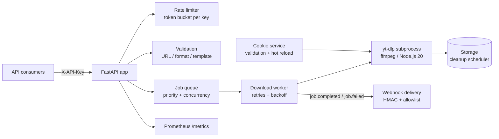

# yt-dlp REST API

[](https://github.com/fvadicamo/yt-dlp-api/actions/workflows/ci.yml)
[](https://github.com/fvadicamo/yt-dlp-api/actions/workflows/docker-publish.yml)
[](https://github.com/fvadicamo/yt-dlp-api/releases)
[](https://github.com/fvadicamo/yt-dlp-api/actions/workflows/ci.yml)
[](https://github.com/fvadicamo/yt-dlp-api/blob/main/pyproject.toml)
[](LICENSE)

A production-ready REST API for video downloads, metadata extraction and **transcripts** using [yt-dlp](https://github.com/yt-dlp/yt-dlp). Built for automation pipelines: pull the image, set an API key, start integrating.

## Why this one

Compared to other self-hosted yt-dlp wrappers (download UIs, thin CLI bridges), this project is an **API-first backend** designed to be consumed by other systems:

- **Transcripts as data**: `GET /api/v1/transcript` returns manual subtitles or auto-captions as timed JSON segments, plain text, SRT or VTT, without downloading any media. Built for AI/RAG ingestion and content pipelines.
- **Webhooks instead of polling**: HMAC-signed `job.completed` / `job.failed` notifications with retries, SSRF-safe host allowlist.
- **Async job queue**: priority queue, concurrency limits, retry with exponential backoff, progress tracking, sync mode when you need it.
- **Production posture**: API key auth, per-key token-bucket rate limiting, input validation (command injection, path traversal), Prometheus metrics, structured JSON logs, health/liveness/readiness probes, non-root hardened container.
- **Cookie lifecycle**: Netscape cookie validation, age warnings, hot-reload endpoint without restart.
- **Quality gates**: 890+ tests at 94% coverage, blocking CI (lint, types, security, container smoke test), weekly image refresh with the latest yt-dlp.

## Quick start

### Run the published image (recommended)

```bash
mkdir -p downloads cookies

docker run -d --name ytdlp-api \
  -p 8000:8000 \
  -e 'APP_SECURITY_API_KEYS=["your-secure-api-key"]' \
  -e APP_SECURITY_ALLOW_DEGRADED_START=true \
  -v ./downloads:/app/downloads \
  -v ./cookies:/app/cookies:ro \
  ghcr.io/fvadicamo/yt-dlp-api:latest

curl http://localhost:8000/health
```

Image tags:

| Tag | Content | Refresh |
|-----|---------|---------|
| `latest`, `X.Y.Z`, `X.Y` | Latest release, yt-dlp pinned at release time | On release |
| `weekly` | Latest default branch + **latest yt-dlp** | Every Monday |

`linux/amd64` and `linux/arm64` are published for every tag. Use `weekly` if YouTube changes break downloads and you want fixes before the next release.

### Docker compose

```bash
git clone https://github.com/fvadicamo/yt-dlp-api.git
cd yt-dlp-api
mkdir -p downloads cookies logs
echo 'API_KEY=["your-secure-api-key"]' > .env
echo 'ALLOW_DEGRADED_START=true' >> .env   # optional: start without cookies
docker compose up -d
```

### Local development

```bash
python3 -m venv venv && source venv/bin/activate
pip install -r requirements-dev.txt
uvicorn app.main:app --reload
```

## API usage

All API endpoints (except health checks, docs and metrics) require the `X-API-Key` header.

### Get a transcript (no download)

```bash
# Timed JSON segments + flattened text
curl -H "X-API-Key: your-api-key" \
  "http://localhost:8000/api/v1/transcript?url=https://www.youtube.com/watch?v=dQw4w9WgXcQ&lang=en"

# Plain text (feed it straight to an LLM)
curl -H "X-API-Key: your-api-key" \
  "http://localhost:8000/api/v1/transcript?url=https://www.youtube.com/watch?v=dQw4w9WgXcQ&fmt=text"

# SRT / raw VTT
curl -H "X-API-Key: your-api-key" \
  "http://localhost:8000/api/v1/transcript?url=...&fmt=srt"
```

Parameters: `lang` (default `en`), `source` (`manual` subtitles, `auto` captions, or `any`: manual first with auto fallback), `fmt` (`json`, `text`, `srt`, `vtt`). Returns 404 `TRANSCRIPT_NOT_FOUND` when the language has no captions.

### Get video info

```bash
curl -H "X-API-Key: your-api-key" \
  "http://localhost:8000/api/v1/info?url=https://www.youtube.com/watch?v=dQw4w9WgXcQ"
```

### List formats

```bash
curl -H "X-API-Key: your-api-key" \
  "http://localhost:8000/api/v1/formats?url=https://www.youtube.com/watch?v=dQw4w9WgXcQ"
```

### Download (async) with webhook notification

```bash
curl -X POST -H "X-API-Key: your-api-key" -H "Content-Type: application/json" \
  -d '{
    "url": "https://www.youtube.com/watch?v=dQw4w9WgXcQ",
    "format_id": "best",
    "webhook_url": "https://automation.example.com/hooks/ytdlp"
  }' \
  http://localhost:8000/api/v1/download
# → 202 {"job_id": "...", "status": "pending", ...}

# Poll manually if you prefer
curl -H "X-API-Key: your-api-key" http://localhost:8000/api/v1/jobs/<job_id>
```

When the job reaches a terminal state, the API POSTs a JSON payload to `webhook_url` with headers `X-Webhook-Event` (`job.completed` | `job.failed`), `X-Webhook-Delivery` (uuid) and, if a secret is configured, `X-Webhook-Signature: sha256=<hmac-hex>` computed over the raw body. Webhooks are **disabled by default**: enable them and allowlist target hosts explicitly (see below).

### Extract audio only

```bash
curl -X POST -H "X-API-Key: your-api-key" -H "Content-Type: application/json" \
  -d '{"url": "https://www.youtube.com/watch?v=dQw4w9WgXcQ", "extract_audio": true, "audio_format": "mp3"}' \
  http://localhost:8000/api/v1/download
```

### Health and metrics

```bash
curl http://localhost:8000/health      # component status (yt-dlp, ffmpeg, cookies, disk)
curl http://localhost:8000/liveness    # k8s liveness probe
curl http://localhost:8000/readiness   # k8s readiness probe
curl http://localhost:8000/metrics     # Prometheus metrics
```

## Architecture



## Integration recipes

- **Workflow engines** (n8n, Airflow, Temporal, ...): trigger `POST /download` with a `webhook_url` pointing at your engine's webhook trigger; the signed callback resumes the flow with file path and metadata. No polling loops.
- **AI / RAG ingestion**: `GET /transcript?fmt=text` gives clean plain text per video; `fmt=json` keeps timestamps for chunking with time anchors.
- **External transcription pipelines**: for videos without captions, `POST /download` with `extract_audio=true` plus a webhook lets your STT stack (Whisper-class models, diarization) pick up the audio file the moment it is ready.
- **Dashboards**: scrape `/metrics` (request rates, download durations, queue depth, webhook delivery outcomes, cookie age).

## Cookie setup (required for most YouTube downloads)

YouTube requires authentication cookies for most downloads (transcripts of public videos often work without). Export cookies from your browser:

**Chrome**: install [Get cookies.txt LOCALLY](https://chrome.google.com/webstore/detail/get-cookiestxt-locally/cclelndahbckbenkjhflpdbgdldlbecc), log in to youtube.com, export as `cookies/youtube.txt`.

**Firefox**: install [cookies.txt](https://addons.mozilla.org/en-US/firefox/addon/cookies-txt/), log in to youtube.com, export as `cookies/youtube.txt`.

```bash
# Validate
curl -X POST -H "X-API-Key: your-api-key" -H "Content-Type: application/json" \
  -d '{"provider": "youtube"}' http://localhost:8000/api/v1/admin/validate-cookie

# Hot-reload after replacing the file (no restart)
curl -X POST -H "X-API-Key: your-api-key" -H "Content-Type: application/json" \
  -d '{"provider": "youtube"}' http://localhost:8000/api/v1/admin/reload-cookie
```

## Configuration

Common environment variables (full reference: [CONFIGURATION.md](CONFIGURATION.md)):

| Variable | Default | Description |
|----------|---------|-------------|
| `APP_SECURITY_API_KEYS` | (required) | JSON array of API keys, e.g. `["key1", "key2"]` |
| `APP_SECURITY_ALLOW_DEGRADED_START` | `false` | Start without valid cookies |
| `APP_YOUTUBE_COOKIE_PATH` | – | Path to the Netscape cookie file |
| `APP_LOGGING_LEVEL` | `INFO` | DEBUG, INFO, WARNING, ERROR |
| `APP_WEBHOOKS_ENABLED` | `false` | Master switch for job webhooks |
| `APP_WEBHOOKS_ALLOWED_HOSTS` | `[]` | JSON array of allowed webhook hostnames |
| `APP_WEBHOOKS_SECRET` | – | HMAC-SHA256 signing key for deliveries |
| `APP_STORAGE_CLEANUP_AGE` | `24` | Hours before downloaded files are cleaned |
| `APP_DOWNLOADS_MAX_CONCURRENT` | `5` | Parallel download limit |

## API reference

| Endpoint | Method | Description |
|----------|--------|-------------|
| `/health` | GET | Health check with component status |
| `/liveness` | GET | Liveness probe |
| `/readiness` | GET | Readiness probe |
| `/metrics` | GET | Prometheus metrics |
| `/api/v1/info` | GET | Video metadata |
| `/api/v1/formats` | GET | Available formats |
| `/api/v1/transcript` | GET | Transcript as JSON/text/SRT/VTT |
| `/api/v1/download` | POST | Start download job (async or sync) |
| `/api/v1/jobs/{id}` | GET | Job status and result |
| `/api/v1/admin/validate-cookie` | POST | Validate provider cookies |
| `/api/v1/admin/reload-cookie` | POST | Hot-reload cookies |

Interactive documentation at `/docs` (Swagger UI) and `/redoc`.

## Error codes

| Code | HTTP | Description |
|------|------|-------------|
| `INVALID_URL` | 400 | URL malformed or unsupported |
| `INVALID_FORMAT` | 400 | Format ID invalid |
| `INVALID_TEMPLATE` | 400 | Output template invalid or path traversal |
| `FORMAT_NOT_FOUND` | 400 | Requested format not available |
| `WEBHOOK_NOT_ALLOWED` | 400 | Webhooks disabled or host not allowlisted |
| `AUTH_FAILED` | 401 | API key missing or invalid |
| `VIDEO_UNAVAILABLE` | 404 | Video private/deleted/geo-blocked |
| `JOB_NOT_FOUND` | 404 | Job ID not found or expired |
| `TRANSCRIPT_NOT_FOUND` | 404 | No captions for the requested language |
| `RATE_LIMIT_EXCEEDED` | 429 | Rate limit hit, check Retry-After |
| `DOWNLOAD_FAILED` | 500 | Download operation failed |
| `PROVIDER_ERROR` | 500 | Video provider error |
| `QUEUE_FULL` | 503 | Download queue at capacity |
| `STORAGE_FULL` | 503 | Insufficient disk space |

## Troubleshooting

**"No provider available for URL"**: the YouTube provider may be disabled (missing/invalid cookies). Check `/health`, re-export cookies, or set `APP_SECURITY_ALLOW_DEGRADED_START=true` for testing.

**"Cookie validation failed"**: cookies expire; re-export from the browser and hot-reload. Netscape format is required.

**"TRANSCRIPT_NOT_FOUND"**: the video has no captions in that language; try `source=auto` explicitly or another `lang`.

**Rate limited (429)**: wait `Retry-After` seconds. Defaults: metadata 100 rpm, downloads 10 rpm per key.

**Container won't start**: ensure `APP_SECURITY_API_KEYS` is set; check `docker compose logs -f`. An unreadable cookie mount degrades the provider instead of crashing (v0.2.0+).

## Documentation

| Document | Description |
|----------|-------------|
| [DEPLOYMENT.md](DEPLOYMENT.md) | Docker and Kubernetes deployment guide |
| [CONFIGURATION.md](CONFIGURATION.md) | Complete configuration reference |
| [CHANGELOG.md](CHANGELOG.md) | Version history |
| [CONTRIBUTING.md](CONTRIBUTING.md) | Development setup and guidelines |
| [RELEASING.md](RELEASING.md) | Release process |
| [SECURITY.md](SECURITY.md) | Security policy |

## Development

```bash
make setup   # install deps + pre-commit hooks
make test    # run the test suite (890+ tests)
make check   # format, lint, types, security, tests
```

## System requirements

- Python 3.11+ (local development)
- Docker (recommended for deployment; image ships ffmpeg and Node.js 20)
- 1 GB RAM / 2 CPU minimum, see [DEPLOYMENT.md](DEPLOYMENT.md) for sizing tiers

## Legal note

Downloading content may violate the terms of service of the platforms involved. This software is provided for lawful use cases (own content, licensed material, public-domain media). You are responsible for how you use it.

## License

[MIT](LICENSE)
